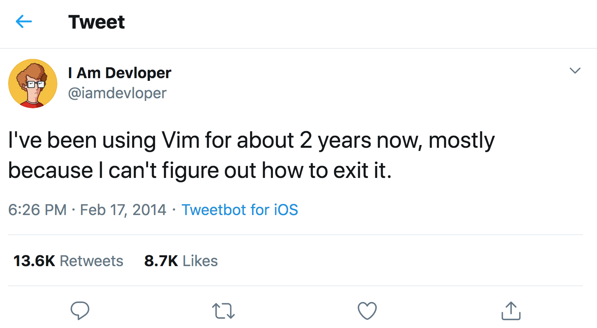

# why vim is for me and i am for vim



---

## background

- tried eclipse, 
- tried sublime, 
- tried vscode, 
- tried emacs, 
- and here I am back where I started

---

## main reasons

- keep my fingers on the keyboard
- fast movement and _text_ manipulation
- environment agnostic editing
- time agnostic editing

---

## demo

- movement
- moving/duplicating x lines
- record and replay macros x times
- surround
- tab / screen management + tmux
- coc -> typescript completion

## getting started

`vimtutor`

## pro module tips

```
ack.vim               tcomment              vim-fugitive          vim-signify
coc.nvim              tlib_vim              vim-graphql           vim-snipmate
ctrlp.vim             typescript-vim        vim-javascript        vim-snippets
nerdtree              vim-addon-mv-utils    vim-jsx-typescript    vim-styled-components
sparkup               vim-airline           vim-multiple-cursors  vim-surround
syntastic             vim-airline-themes    vim-repeat            vim-unimpaired
```
my vim config: [https://github.com/peterpeerdeman/pp-dotfiles/tree/master/vim/bundle](https://github.com/peterpeerdeman/pp-dotfiles/tree/master/vim/bundle)

